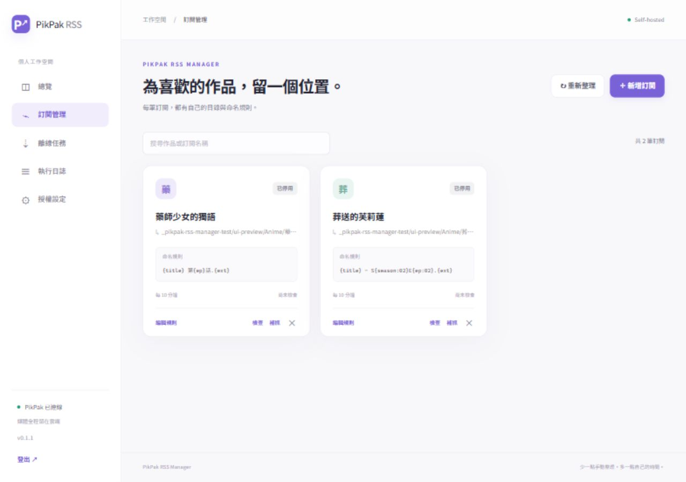
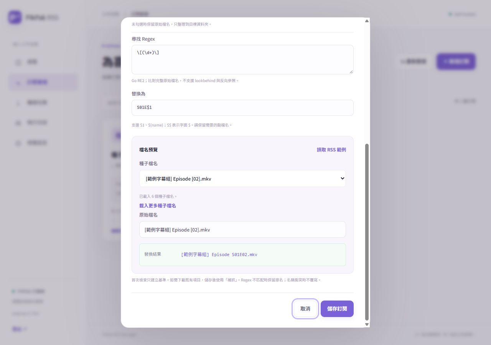

# PikPak RSS Manager

輕量的個人自託管 RSS／Atom 追蹤與 PikPak 雲端整理服務。每筆訂閱可選取或新增 PikPak 資料夾，勾選重命名後以 Regex 尋找／替換檔名。透過官方 PAT＋MCP 建立離線任務，再依檔案 ID 整理到指定位置。

Go 1.27.1、SQLite、原生 JavaScript/CSS；單一執行檔，無需 rclone、PikPak CLI、LLM、MySQL、Redis 或前端建置工具。MIT 授權。

[](https://github.com/wade00754/pikpak-rss-manager/actions/workflows/ci.yml)
[](https://github.com/wade00754/pikpak-rss-manager/actions/workflows/docker-publish.yml)

## 功能

- 繁體中文管理面板、手機介面、單一管理員登入。
- RSS／Atom 訂閱新增、編輯、刪除、停用、手動檢查及補抓。
- PikPak 資料夾瀏覽、路徑導覽、搜尋與新增，按 ID 保存選擇。
- 每筆獨立的「重命名檔案」開關、Regex 尋找／替換及即時檔名預覽；預設保留原名。
- 直接讀取 RSS 中的種子檔名範例；預覽只顯示替換結果，並簡短提示不適用字元的調整。
- 既有季數／命名範本保持相容，不會因更新而停用或改變規則。
- Magnet v1/v2 與小型 `.torrent` 中繼資料解析；同一帳號按正規化 infohash 去重。
- 離線任務與逐檔操作持久化，重啟後接續，提交結果不明時先核對。
- 多檔種子逐檔解析；衝突或無法判定時保留原名，附屬檔案保持完整。
- PAT 可由面板加密保存、環境變數或私密檔案提供；不回傳或記錄權杖。
- GHCR 公開映像：`ghcr.io/wade00754/pikpak-rss-manager:latest`，支援 `linux/amd64`、`linux/arm64`。



## Docker Compose 快速開始

將 [docker-compose.yml](docker-compose.yml) 放進一個目錄。在同一目錄建立 `.env`，填入你自己的管理密碼：

```dotenv
APP_ADMIN_PASSWORD=請換成你自己的密碼
# 使用 HTTPS 反向代理時設定精確的網站來源，不包含路徑。
APP_PUBLIC_URL=https://rss.example.com
```

```sh
docker compose up -d
docker compose ps
```

映像預設只將面板映射到主機 `127.0.0.1:8080`。同一主機的反向代理可連線至 `http://127.0.0.1:8080`；代理本身若在容器內，請依 [部署文件](docs/deployment.md) 配置共同 Docker 網路。初次登入後，前往「授權設定」綁定 PikPak PAT。

### 1Panel「容器 → 編排」

1. 建立編排，名稱可用 `pikpak-rss-manager`，貼上本專案的 Compose。
2. 在編排的環境設定／`.env` 設定 `APP_ADMIN_PASSWORD`；如果該版本的 1Panel 沒有此欄位，將 Compose 的 `${APP_ADMIN_PASSWORD:?...}` 換成**你自己的密碼**。包含 `:`、`#`、`$` 等字元時注意 YAML 與 Compose 插值規則（字面 `$` 使用 `$$`）。
3. 使用網域反向代理時，同時設定 `APP_PUBLIC_URL`，例如 `https://rss.example.com`。
4. 啟動編排，確認容器健康。反向代理的上游為主機的 `127.0.0.1:8080`，或共同網路中的 `pikpak-rss-manager:8080`。
5. 登入 → 授權設定 → PAT 綁定 → 新增訂閱 → 選擇資料夾 → 視需要勾選重命名與預覽 → 儲存。

PikPak PAT 不需要放進 GitHub 或 Actions。Compose 使用面板綁定，會把加密權杖與金鑰保存在持久化資料卷。

## 授權設定

在 PikPak 官方「存取與整合／Access & Integrations」建立 PAT，授予帳號資訊、檔案讀取、寫入／管理與雲端下載的必要權限；實際權限名稱以官方介面為準。本服務不使用分享、永久刪除或邀請工具。

PAT 來源的優先順序為 `PIKPAK_TOKEN_FILE` → `PIKPAK_TOKEN` → 面板加密保存的權杖。使用外部來源時，面板不能覆寫 PAT；更新外部設定後需重新啟動。失效或配額不足會暫停相關任務；更新授權、重新檢查連線後，可逐一接續暫停的任務。更換帳號會暫停舊帳號任務。

PAT 可設定 30 天至一年有效期；已連接應用共用各流量維度月配額的 25%。RSS、種子中繼資料與管理 API 仍會使用少量 VPS 網路流量；影片內容不經 VPS。離線能否秒傳取決於 PikPak 快取、來源與配額。[官方 PAT 說明](https://mypikpak.com/en-US/help-center/connected_apps/personal_access_tokens/create_personal_access_token)、[Connected Apps FAQ](https://mypikpak.com/en-US/connect-apps-faq)。

官方亦提供瀏覽器 OAuth 授權與公開 discovery。這個版本仍使用 PAT；對單帳號自託管的背景排程，PAT 設定較簡單，但到期需更換。OAuth 可改善一鍵連接與更新權杖的體驗，還需實作及驗證註冊、回呼與更新流程。[OAuth／PAT 調研與官方連結](docs/auth-comparison.md)。

## 訂閱、資料夾與命名

新增訂閱的第一次檢查只建立基準，後續才處理新項目。若要處理 RSS 目前仍保留的項目，按該訂閱的「補抓」。資訊源變更時重新建立基準；已提交的相同 infohash 仍會按帳號去重。刪除訂閱保留已建立的任務與雲端檔案；停用訂閱只停止排程檢查。

補抓會重新解析目前 feed 中的來源，再按當前帳號去重。因此換帳號後可明確補抓既有項目，且不會沿用舊帳號的任務／檔案 ID。

### 選取或新增資料夾

在新增／編輯訂閱中按「選擇資料夾」，點擊資料夾進入下一層，使用路徑導覽返回上層，最後按「使用此資料夾」；也可選取根目錄。清單只顯示資料夾，搜尋篩選目前已載入的項目；有其他頁面時按「載入更多資料夾」。

按「＋ 新增資料夾」開啟小視窗，填寫名稱並按「建立資料夾」，會在目前位置立即建立 PikPak 資料夾並開啟它，再按「使用此資料夾」套用。同名項目不重複建立；建立結果不明時不自動重送。也可手動輸入如 `Anime/葬送的芙莉蓮` 的路徑，任務執行時會建立尚未存在的路徑。

選取的資料夾按實際 ID 綁定帳號，同名資料夾不會混淆。更換 PikPak 帳號後需重新選取目標資料夾，相關訂閱會先顯示錯誤，不會套用舊帳號的 ID。

### 重命名檔案（Regex 尋找／替換）

新增訂閱預設**不勾選**「重命名檔案」，保留原始檔名。勾選後填寫「尋找 Regex」及「替換為」，按「讀取 RSS 範例」取得種子內的檔名，或手動輸入完整原始檔名。修改原始檔名或命名規則、切換種子範例時，替換結果會即時更新。例如：

```text
原始檔名：[字幕組] 葬送的芙莉蓮 - 03 [1080p].mkv
尋找 Regex：^\[[^\]]+\]\s*
替換為：（留空）
新檔名：葬送的芙莉蓮 - 03 [1080p].mkv
```

也可透過捕捉群組組合新檔名：

```text
原始檔名：葬送的芙莉蓮_03.mkv
尋找 Regex：^(?P<title>.+)_(?P<ep>\d+)\.(?P<ext>[^.]+)$
替換為：${title} - E${ep}.${ext}
新檔名：葬送的芙莉蓮 - E03.mkv
```

替換格式支援 `$1`、`${1}`、`${name}`，`$$` 表示字面 `$`；接續文字時使用 `${1}文字` 避免群組名稱混淆。尋找使用 Go RE2，不支援 lookbehind 與反向參照。替換會套用到檔名的所有匹配，未匹配時保留原名；不使用 RSS 標題回退，請包含或保留需要的副檔名。預覽和正式重命名共用相同程式。

範例下拉選單只列出 `.torrent` 中繼資料中單檔／多檔的實際檔名，選項直接顯示檔名。按「載入更多種子檔名」可接續讀取更多 RSS 來源，也能續讀同一個多檔種子的其餘檔名。每批最多檢查五筆來源、讀取三個種子中繼資料（每個最多 2 MiB），回傳三十筆範例；載入更多時保留目前選取與手動輸入的檔名。來源或種子內容在分頁間改變時，會提示重新讀取。

來源由 Go 的 `net/http` 取得，RSS／Atom 使用 `github.com/mmcdole/gofeed` 解析，`.torrent` 使用 `github.com/zeebo/bencode` 解碼。v1 讀取 `info.name`（單檔）或 `info.files[].path`（多檔；優先使用 UTF-8 欄位），v2 則走訪 `info.file tree` 的檔案節點。預覽只讀取中繼資料，不建立離線任務、不變更首次基準，也不下載媒體內容。同一筆 RSS 同時有 Magnet 與 `.torrent` 時，預覽優先讀取種子。

只有 Magnet 或無法取得種子檔名時，請手動輸入原始檔名。Magnet 的 `dn` 是可選的顯示名稱，可能是合集名稱，亦可能與種子內的單檔名稱不同；實際重命名以 PikPak 回傳的檔名為準。參考 [Magnet 規格（BEP 9）](https://www.bittorrent.org/beps/bep_0009.html)、[v1 種子格式（BEP 3）](https://www.bittorrent.org/beps/bep_0003.html)、[v2 種子格式（BEP 52）](https://www.bittorrent.org/beps/bep_0052.html)。

為相容常見檔案系統，儲存檔名中的 `/`、`\`、`:`、`*`、`?`、`"`、`<`、`>`、`|` 與控制字元會轉成 `_`，並移除前後空白／句點。預覽只顯示最後的「替換結果」；若有調整，簡短提示「檔名含不適用字元，已自動替換或移除。」例如 `中文 / English [01].mkv` 用 `\[(\d+)\]` → `S01E$1`，預覽結果為 `中文 _ English S01E01.mkv`。



### 既有命名範本相容模式

升級前建立的訂閱保持原本的命名範本與啟用狀態，編輯時可繼續使用，或切換為 Regex 尋找／替換。例如發布標題：`[字幕組] 葬送的芙莉蓮 - 03 [1080p]`。

```text
作品名稱：葬送的芙莉蓮
目錄：Anime/葬送的芙莉蓮
Regex：-\s*(?P<ep>\d+).*?\[(?P<resolution>\d+p)\]
範本：{title} - S{season:02}E{ep:02} [{resolution}].{ext}
結果：葬送的芙莉蓮 - S01E03 [1080p].mkv
```

支援 `{title}`、`{season}`、`{ep}`、`{resolution}`、`{ext}`。季數與集數可用 `{season:02}`、`{ep:03}` 補零，寬度 1–6。`title` 為該訂閱的作品名稱，`ext` 取自實際雲端檔案；預覽未指定檔名時以 `.mkv` 示意。

Regex 使用 Go RE2，具名群組寫成 `(?P<ep>...)`、`(?P<season>...)`、`(?P<resolution>...)`。不支援 lookbehind 與反向參照。預設規則處理 `S01E03`、`第3話`、` - 03 ` 等常見格式；請用實際發布標題及檔名測試每筆訂閱。

多檔種子逐一處理影片檔名；相容模式只有一個主要檔案才可用 RSS 標題補足變數，多個影片不可把同一集數套給全部。附屬檔案移至目標目錄的 `_附件/<任務ID>/`，保留原名與子目錄。新任務的暫存位置是**訂閱目標目錄內**的 `_PikPak-RSS-Staging/<任務ID>/`；例如 `Anime/作品/_PikPak-RSS-Staging/<任務ID>/`。若目標選根目錄，暫存也在根目錄。解析失敗或名稱衝突的影片保留在該任務暫存位置，可修正規則後重試。空暫存目錄保留，不自動刪除；升級前的任務沿用原有暫存 ID，既有根目錄暫存資料不會自動搬移或刪除。

官方 MCP `add_link` 不接受新檔名，因此下載完成後才執行雲端重命名／移動。沒有本地媒體搬運，也不覆寫同名檔案。提交結果不明的任務只會重新核對專用暫存目錄；未能唯一確認時需在 PikPak 檢查，不會重新提交。[官方 MCP 說明](https://mypikpak.com/en-US/help-center/connected_apps/mcp/connect_ai_tool)。

## 本機開發

需要 Git 與支援自動下載 toolchain 的 Go。`go.mod` 固定 Go 1.27.1；`GOTOOLCHAIN=auto` 可自動取得，不會更改系統 Go 安裝。

```sh
cp .env.example .env  # 僅限尚未存在 .env；不要覆蓋既有權杖
# 編輯 .env，設定管理密碼
go run ./cmd/pikpak-rss-manager
go test ./...
go vet ./...
```

Windows 可用 `./scripts/dev.ps1` 與 `./scripts/verify.ps1`。測試預設不使用真實 PAT 或網路雲端操作；[驗證文件](docs/verification.md) 說明選擇性實測與限制。JSON API 需要登入 Cookie；修改請求須同時帶 `pp_csrf` Cookie 與 `X-CSRF-Token`。詳細資料結構及流程見 [架構文件](docs/architecture.md)。

`./scripts/dev.ps1` 自動將目前 Git 版本傳入程式，例如 `v0.3.3-dev`；標籤後的提交與未提交變更也會顯示。`./scripts/dev.ps1 -Version` 可只查看版本，不讀取設定或啟動服務。沒有可用的 Git 資訊，或直接執行未指定版本的 `go run`／`go build` 時，版本顯示 `dev`；發布映像由建置流程傳入正式標籤或提交。

管理密碼沒有長度與字元限制，短密碼、中文及超過 72 位元組的密碼皆可使用；仍需自行設定密碼，沒有預設值。本機腳本會遮蔽密碼輸入，啟動後以同一組密碼登入。

## 發布、更新與備份

GitHub Actions 在推送 `main` 或 Tag 時，先執行測試、vet 及 Compose 啟動／資料持久化測試，再發布兩種架構。`main` 產生 `latest`、`main`、`sha-...`；Tag 產生對應 Tag、版本與提交標籤。使用 `GITHUB_TOKEN`，不需自行保存 GHCR 發布權杖。[GitHub 官方 GHCR 文件](https://docs.github.com/en/packages/working-with-a-github-packages-registry/working-with-the-container-registry)。

公開映像另以未登入 GHCR 的 Runner 驗證匿名拉取、Compose 啟動與重建後資料保留；包含 amd64 與 QEMU arm64。驗證結果與真實 PikPak 實測限制記錄於 [verification.md](docs/verification.md)。

```sh
docker compose pull
docker compose up -d
```

備份前停止服務，備份**整個資料卷**，包含 `manager.db`、可能存在的 WAL／SHM 與 `secret.key`。遺失金鑰就無法解密已保存的權杖與私密訂閱連結；金鑰和備份都應限制存取。不要使用 `docker compose down -v` 更新服務。[完整部署／備份步驟](docs/deployment.md)。
