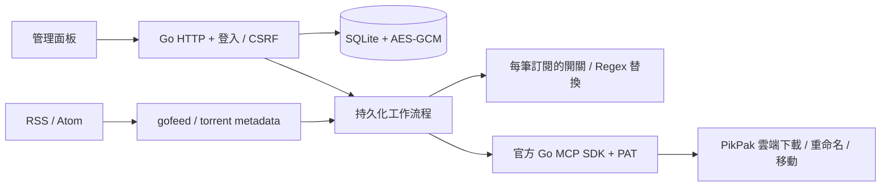
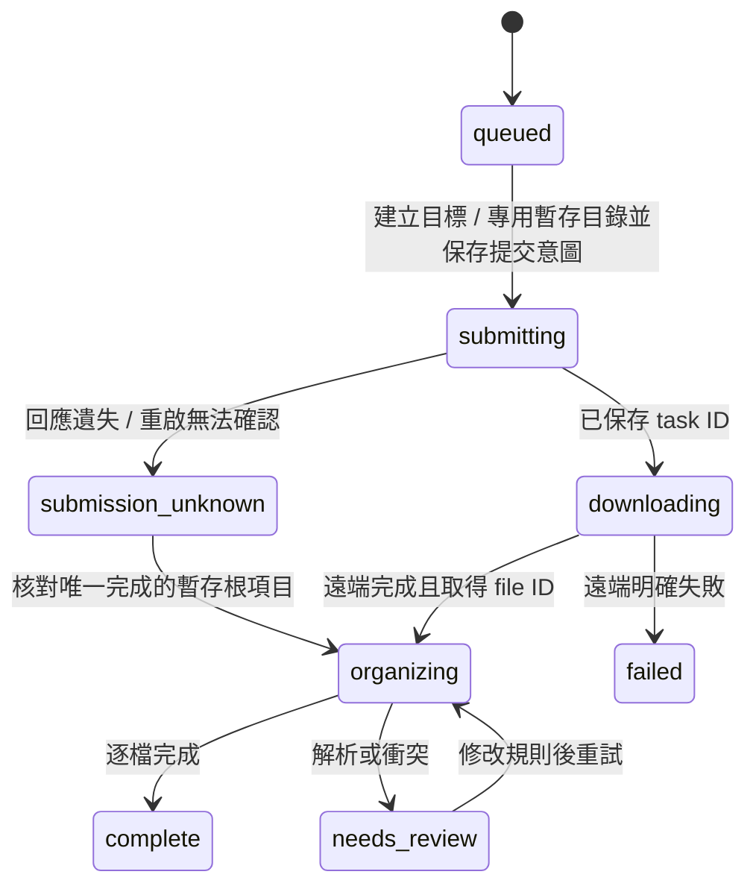

# 架構與產品行為

本服務以 Go 1.27.1 單一程序執行，HTML／CSS／JavaScript 透過 `go:embed` 打包。標準庫 `net/http`、`html/template` 提供面板與 JSON API；gofeed 解析 RSS／Atom；zeebo/bencode 解析有大小與深度限制的種子；modernc SQLite 提供 CGO-free 儲存；官方 MCP Go SDK 連線至 `https://pikpak.ai/mcp`。依賴版本固定於 go.mod／go.sum。

## 模組與資料

| 目錄 | 責任 |
|---|---|
| `cmd/pikpak-rss-manager` | serve、version、healthcheck、signal 處理 |
| `internal/app` | 設定、儲存、MCP、HTTP 與 worker 生命週期 |
| `internal/config` | 監聽位址／資料目錄、網站網址驗證 |
| `internal/model` | 訂閱、規則、任務、逐檔操作與日誌 |
| `internal/store` | SQLite、首次基準、帳號去重、加密與進度 |
| `internal/feed` | 限流量 HTTP 讀取、RSS／Atom、Magnet／torrent |
| `internal/rename` | 開關、RE2 尋找／替換、既有範本相容與預覽 |
| `internal/pikpak` | 型別化 MCP、資料夾導覽／建立、授權與帳號切換 |
| `internal/worker` | 檢查、提交、查詢、重命名／移動與重試 |
| `internal/web` | Cookie session、CSRF、繁體中文 UI／API |

SQLite 使用 WAL、foreign_keys、busy_timeout，單一連線避免同時寫入競爭。`subscriptions` 保存個別規則及排程時間，`seen_items` 保存基準／已處理 fingerprint，`jobs` 以 `(account_id, resource_key)` 建立唯一約束；`file_actions` 保存逐檔狀態；`events` 保留 30 天，API 顯示最近 150 筆。任務 API 顯示最近 200 筆，排程仍會處理較舊的未完成任務。

PAT、RSS URL 與含 tracker／來源參數的資源 URL 以 AES-256-GCM 加密，金鑰置於資料目錄的 `secret.key`。帳號 ID 僅用於內部去重與保護，任務 API 不回傳帳號 ID 或資源 URL。面板可讀取訂閱 URL 以便編輯；只有已登入管理員能取得。

訂閱 payload 保存 `rename_enabled`、`rename_mode`、`replacement`，以及選取資料夾的 `destination_id` 與內部帳號 ID。舊 payload 缺少開關時視為啟用，缺少模式時沿用範本；無需改動 SQL schema。回傳前產生程序內 HMAC 的不透明帳號參照，前端不取得原始帳號 ID。選取資料夾保存時以 `get` 追溯路徑，排程按 ID 存取；同名資料夾仍有獨立身分。

## 工作流程與失敗邊界

新訂閱初次建立目前 feed fingerprint 的基準。手動補抓可將基準項目轉成任務；不同 tracker、不同訂閱但相同正規化 infohash 不會重複提交。資源解析失敗不標記已處理，以便之後重試。RSS metadata 上限 2 MiB、2000 項，`.torrent` 上限 2 MiB；不抓取 HTML 詳細頁，也不下載媒體。

提交前保存 `submitting`。SDK 關閉 transport 自動重試，不在一次 call 中重送失敗 mutation。結果不明時只核對此任務專用暫存目錄：唯一且完成才接續，否則 `submission_unknown` 保留給管理員查看。授權／配額拒絕暫停；明確限流可安全延後。其他暫時錯誤採 30 秒、2 分、10 分、30 分、2 小時退避，六次後待處理。遠端下載七天未完成轉待處理。

新任務的暫存容器 `_PikPak-RSS-Staging` 在該任務目標目錄內，再建立 `<jobID>` 隔離子目錄；目標選根目錄時才建立於根目錄。已保存 `staging_id` 的任務直接接續原位置，不因更新搬移或刪除舊暫存。整合測試的明確 `StagingPath` 使用專用測試根路徑，避免操作既有內容。

整理前保存原始主要檔案數與完整逐檔計畫，避免部分移動後誤判單檔。重試依檔案 ID 核對當前名稱／目錄，跳過已完成操作。一次 worker 雲端整理與面板換帳號共用互斥鎖；不同帳號不能接續舊檔案 ID。任務保存建立時的目錄與規則快照；重試會套用目前訂閱的命名規則，既有目標目錄仍保留。

未啟用重命名時，主要檔案按原名移動。Regex replace 模式對每個實際檔名使用 RE2 `ReplaceAllString`；未匹配保留原名，替換群組與安全檔名驗證由預覽及正式流程共用。既有範本模式按自己的檔名提取變數，只有一個主要檔案才容許 RSS 補足。附屬檔案保留名稱／目錄，移至 `_附件/<jobID>`。目標已存在同名檔案或本次計畫產生重複名稱時，不覆寫，保留待處理。空暫存目錄與下載根目錄不自動刪除。

資料夾瀏覽只回傳 `drive#folder`，保留 MCP 分頁 token；路徑追溯有深度／循環限制。新增時先檢查同名項目，只發送一次 `mkdir`。建立、選取保存與帳號綁定共用 worker 雲端操作鎖；帳號參照過期即拒絕 mutation。既有訂閱若綁定其他帳號的資料夾，檢查時顯示錯誤並停止，不會建立離線任務。手動路徑仍於排程時逐層建立。

來源預覽共用 feed 的 HTTP／私人網路／中繼資料大小限制，最多五筆來源與三次種子讀取。解析 v1／v2 種子的實際 basename，影片優先；回傳最多 30 筆來源範例，再加上同帳號、同訂閱近期任務最多 10 筆原始檔名記錄。Magnet `dn` 與 RSS 標題標註不同來源，不推測副檔名。此 API 不變更基準、去重或任務，也不發出雲端 mutation。

命名預覽回傳 `raw_name`（替換／範本原始結果）與 `name`（共用檔名正規化後的儲存結果）。兩者不同時附 `warnings`，避免讓 `/` → `_` 等檔名調整看起來像 Regex 錯誤。

RSS 與檔案整理排程每五秒掃描到期紀錄；預設訂閱間隔十分鐘。雲端任務序列處理，MCP 呼叫至少間隔 300 ms。任務完成查詢預設約 30 秒，不讓輪詢造成密集請求。單一程序／資料卷不支援多副本並行。

## JSON API

所有 `/api/` 管理介面需登入，除了 session、一次性 setup 與 login。POST／PUT／DELETE 需要 CSRF；setup 與 login 亦需要。首次設定及「系統設定」中的網站網址指定代理後的網站來源及 HTTPS Secure Cookie。初始化前以相同 Host 的 HTTP／HTTPS Origin 驗證，支援 TLS 終止於反向代理；不依賴轉送標頭。Session 保存在記憶體，12 小時到期，服務重啟需重新登入。

管理密碼在首次網頁設定建立，僅要求非空，完整密碼以 Argon2id（64 MiB、3 次、平行度 2）、16 位元組隨機 salt 產生 32 位元組雜湊。SQLite `administrator` 單列只保存含參數與 salt 的驗證值及非私密網站設定，沒有明文或可解密密碼。單列唯一鍵原子阻擋重複初始化；已完成或損毀的驗證值不會回到開放設定狀態。初始化／登入共享按來源 IP 限流及單一運算閘門，限制記憶體耗用，並共用 JSON 請求大小保護。

服務不讀取 `.env` 或外部密碼／PAT。PikPak PAT 統一透過已登入網頁綁定並 AES-GCM 加密；其他網站偏好由網頁保存。程序層級僅保留監聽位址與資料目錄選項。SQLite schema v2 遷移保留所有既有訂閱與工作狀態；升級前只保存在外部設定的管理密碼需在網頁重新設定。初始化完成前不啟動背景排程，已有加密 PAT 完成初始化後重新連線。

| 方法與路徑 | 行為 |
|---|---|
| `GET /healthz` | DB 健康／版本，免登入 |
| `GET /api/session` | 初始化／登入狀態及 CSRF |
| `POST /api/setup` | 首次設定管理密碼、網站網址、內網 RSS 開關；完成後拒絕再次初始化 |
| `POST /api/login`、`POST /api/logout` | 密碼登入／登出 |
| `GET/POST /api/subscriptions` | 列表／新增 |
| `PUT/DELETE /api/subscriptions/{id}` | 更新／刪除 |
| `POST /api/subscriptions/{id}/check` | `{ "backfill": false }`，手動檢查 |
| `GET /api/pikpak/folders?parent_id=…&token=…` | 目前資料夾、路徑導覽、子資料夾、next_token、account_ref |
| `POST /api/pikpak/folders` | `{ "parent_id": "…", "name": "…", "account_ref": "…" }`，在目前位置新增資料夾 |
| `POST /api/feeds/samples` | `{ "url": "https://…", "subscription_id": 1, "cursor": "" }`；回傳 items（title、filename、kind）、notices 及可選的 next_cursor；每批最多五筆來源／三次種子讀取／三十筆範例，使用 next_cursor 接續讀取；不建立任務 |
| `POST /api/rules/preview` | `{ "rule": {title, rename_enabled, mode: "replace", regex, replacement}, "filename": "actual.mkv" }`；回傳 old_name、raw_name、name、matched、warnings |
| `GET /api/jobs`、`GET /api/jobs/{id}` | 任務及逐檔紀錄 |
| `POST /api/jobs/{id}/retry` | 從安全階段接續／核對 |
| `GET /api/events` | 近期操作日誌 |
| `GET/POST /api/settings/pikpak` | 授權狀態／寫入 PAT |
| `GET/POST /api/settings/app` | 已登入的網站網址及內網 RSS 選項，變更即時生效 |
| `POST /api/settings/pikpak/check` | 重新授權檢查 |

HTTP 有請求大小、標頭與逾時限制；登入按來源 IP 限流，Cookie HttpOnly／SameSite Strict；Origin 驗證、CSP、無外部 CDN。反向代理請保留 Host，對外提供 HTTPS。JSON 錯誤不包含原始雲端回應，以免暴露來源連結或權杖。

訂閱新增／更新可帶 `destination_id` 及瀏覽取得的 `destination_account_ref`，服務端核對帳號後取得實際路徑。手動路徑不帶這兩欄。重命名訂閱欄位為 `rename_enabled`、`rename_mode`、`regex`、`replacement`；舊模式亦接受 `season`、`template`。JSON API 省略開關及模式時保持舊客戶端行為。
